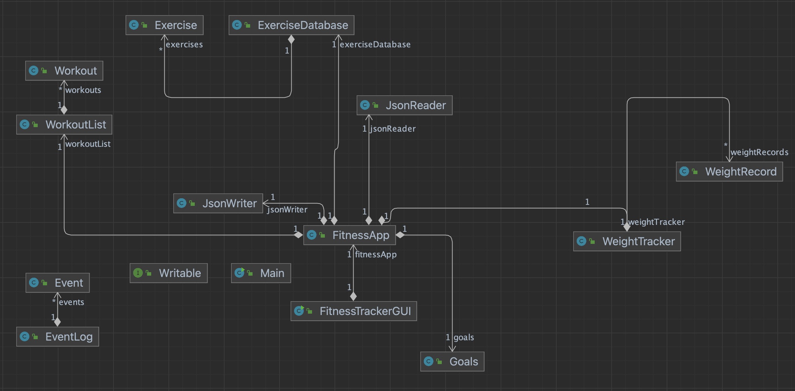

# Fitness Tracker

    The Fitness Tracker application will allow users to track their workouts, set fitness goals, and monitor their progress over time. 

    Fitness enthusiasts, athletes, and individuals who want to maintain a healthy lifestyle.

    As a fitness enthusiast myself, I understand the importance of tracking workouts and staying motivated to achieve fitness goals.

### Workout Logging
- As a user, you can:
    - Log each workout session I complete, including the date and time.
    - Specify the type of exercise for each workout (e.g., running, weightlifting).
    - Record the duration of each workout session in minutes.
    - Note the intensity level of my workouts (e.g., Low, Medium, High).
    - Review my past workouts to track my progress and consistency.

### Fitness Goals Setting
- As a user, you can:
    - Set specific fitness goals for myself (e.g., losing 10 pounds, running a 5k).
    - Update or modify my fitness goals as needed.
    - Track my progress towards achieving these fitness goals over time.
    
### Weight Monitoring
- As a user, you can:
    - Log my weight regularly with dates for each entry.
    - View a history of my weight entries to observe trends over time.
    - Set weight-related goals and monitor my progress towards achieving them.

### Exercise Database Access
- As a user, you can:
    - Access a database of exercises that includes detailed instructions for each exercise.
    - Add custom exercises to the database for personal reference.

### Application Management
- As a user, you can:
    - Save the current state of the application, including all my data and settings, with a single action.
    - Exit the application safely, ensuring that all my recent changes and data entries are saved.
    - Have the option to be prompted to save any unsaved data before exiting the application to prevent data loss.

